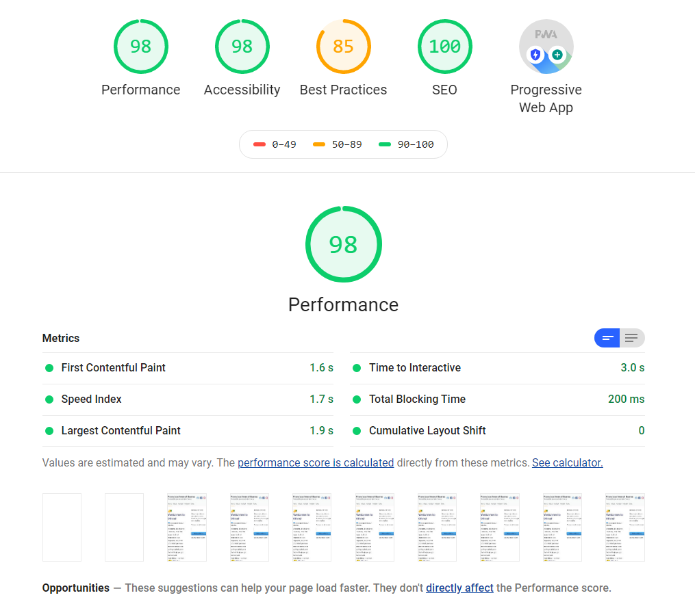

### Platzi Svelte Blog
Proyecto final del curso de Svelte en Platzi 
Para correr el proyecto

    git clone https://github.com/FranciscoImanolSuarez/svelte-blog.git

Luego de clonar el repositorio

    npm run dev

El proyecto estara corriendo en:

    localhost:3000

Para vincular su propia API de Ghost modificar las claves en el archivo `.env`  asi como datos de la pagina en diferentes redes sociales.

Reporte de Lighthouse

